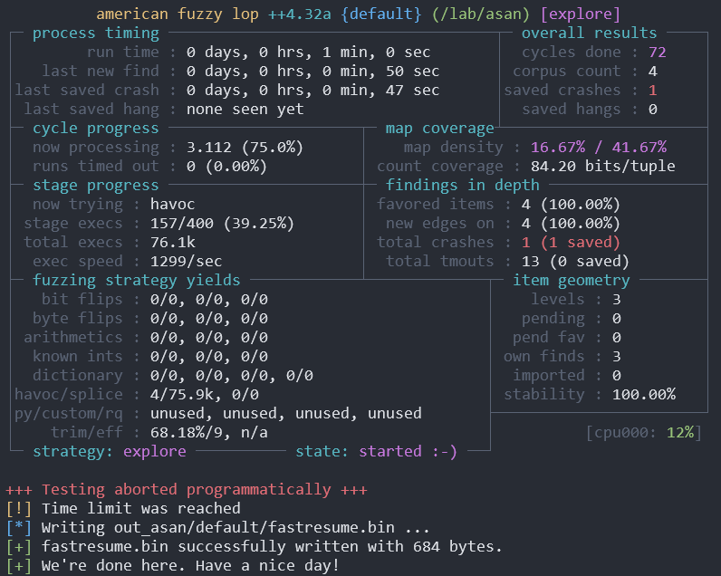

# Lab-02 Fuzzing

In this lab, we will investigate how to use fuzzing to automatically find vulnerabilities in the software. We will use AFL++, one of the most frequently-used coverage-guided fuzzer in both industry and academia, for this lab.

## AFL++

For convenience, simply use [docker](https://github.com/AFLplusplus/AFLplusplus?tab=readme-ov-file#building-and-installing-afl) for our lab:

```bash
docker pull aflplusplus/aflplusplus
docker run -it -v /path/to/CSCI-B639-Labs/02-Fuzzing/:/lab aflplusplus/aflplusplus bash
```

Furthermore, you may need to install following Python packages in the docker.

```bash
pip install lifelines pandas numpy
```

## Program Under Test

In this lab, the program that we are going to fuzz is located at `put.c`. The program contains a simple use-after-free vulnerability that requires a certain input (i.e., `"UAF"`) from `stdin` to trigger. We are going to run AFL++ on this simple vulnerable program aiming to trigger this vulnerability and to conduct several measurements.

## Address Sanitizer

As you may have already learned from the lecture, even if the use-after-free vulnerability has been triggered during the execution, the program would not necessarily abort (which is required for the fuzzer to report the vulnerability). This also applies for this program, which can be confirmed by trying to trigger the UAF using two versions of the binary.

```bash
# Execute in the docker of AFL++.
cd /lab && rm -rf out && mkdir out
/AFLplusplus/afl-cc put.c -o out/normal # Compile without sanitizer.
/AFLplusplus/afl-cc -fsanitize=address put.c -o out/asan # Compile with sanitizer.

# The program should run without abort, printing the garbage in the freed heap.
echo "UAF" | ./out/normal
# The program should abort with "ERROR: AddressSanitizer: heap-use-after-free".
echo "UAF" | ./out/asan
```

Addtionally, to correctly run AFL++, you may need to change the `core_pattern`. This should be executed outside the docker, and with sudo priviledge.

```bash
echo core | sudo tee /proc/sys/kernel/core_pattern
```

Now we can run these two binaries using AFL++. Make sure you run these experiments under same environment! (e.g., Do not use different machine. Do not run other computational intensive jobs on your machine.)

```bash
# Run AFL++ on the binary with address sanitizer for 60 seconds, and repeat 10 times.
rm -rf /lab/out/dir_asan && mkdir /lab/out/dir_asan
for i in {0..9}; do
	/AFLplusplus/afl-fuzz -i /lab/in/ -o /lab/out/dir_asan/$i -V 60 -- /lab/out/asan
done

# Similar for the binary without sanitizer.
rm -rf /lab/out/dir_normal && mkdir /lab/out/dir_normal
for i in {0..9}; do
	/AFLplusplus/afl-fuzz -i /lab/in/ -o /lab/out/dir_normal/$i -V 60 -- /lab/out/normal
done
```

For example, the output of fuzzing the `/lab/out/asan` binary should be something like this:



In the commands above, 3 command-line options are used:

1. `-i`: This is used to specify the input directory storing the initial corpus.
2. `-o`: This is used to specify the output directory. When the fuzzing stops, the directory stores the fuzzing output, which contains following information that we are interested in: a) `default/queue`: This directory stores the final corpus when the fuzzing stops, which contains the initial corpus provided by `-i` and other interesting test cases stored during fuzzing due to new coverage. b) `default/crashes`: This directory stores the test cases that cause the program to crash (e.g., abort). c) `default/fuzzer_stats`: This file contains the statistics about the fuzzing.
3. `-V`: This is the timeout of the whole fuzing campaign, which is set to 60 seconds now.

## Processing The Outputs

We shall focus on three information: fuzzing throughput (i.e., average number of executions per second), time required to expose the vulnerability (i.e., to find the crashing test case), and coverage as the fuzzing campaign runs (i.e., total coverage with respect to fuzzing time). Let's go through them one by one.

### Fuzzing Throughput

To obtain the average number of executions per second, simply find the `execs_per_sec` entry in `default/fuzzer_stats`. For example, you may use the bash command `grep execs_per_sec default/fuzzer_stats`. You task is to gather all of these values among the 10 runs for fuzzing campaigns of both `/lab/out/asan` and `/lab/out/normal`, and fill these values to `throughput_asan` and `throughput_normal` in `stats.py`. Free feel to use any methods you prefer: Bash script, Python script or simply manually gathering. Then running `stats.py` should give the mean throughput for both binaries. Please report such values and try to explain the difference between these two values in your submitted document.

### Time-To-Exposure

Then we need to obtain the average time required to trigger the vulnerability. To achieve this, we need to look at the files in `default/crashes`. For example, you may have something like this in this directory:

```bash
ls default/crashes/
# README.txt  id:000000,sig:06,src:000003,time:18483,execs:22693,op:havoc,rep:1
```

Each file except `README.txt` in this directory represent a stored test case that can crash the program. Since our simple program only contains a UAF, you would at most have one test case here with `id:000000`. To obtain the time taken to find this crashing test case in this fuzzing campaign, simply take the value following `time:`, in the unit of millisecond. It is also possible for this directory to be empty, which suggests timeout: no crash has been triggered during fuzzing campaign. You should collect such time-to-exposure of all 10 repeated fuzzing campaigns in second, using `parse_time()` function provided. In the case of timeout, use `None`. Similarly, fill the TTE values to `tte_asan` and `tte_normal`, and obtain and report the mean TTE. Explain such results in your submitted document.

### Coverage

Finally, we are going to plot an average coverage curve for each 10 repeated runs. Before that, we may need to understand how AFL++ records the coverage of a given execution using a given input. As you may have learned from the lecture, coverage-guided fuzzing instruments each code location of the program-under-test, and when such location is covered during the execution, the location will be added into a set. Therefore, when the execution ends, such set will represent all code locations that have been covered in this execution. In AFL++, such set is implemented using a map (i.e., byte array), where each index represents a code location (i.e., a basic block edge) and a non-zero byte represent that the location has been covered in the execution. To obtain such byte array for each seed in the corpus, use the following command:

```bash
/AFLplusplus/afl-showmap -i default/queue/ -o out/ -b /lab/out/normal
# Please always use `/lab/out/normal` here, not `/lab/out/asan`, even for corpuses of the ASAN campaigns.
# This ensures the consistency of the binary we use to collect coverage.
```

Then you can see that the directory `out/` contains several files with names identical to the seeds in the `default/queue/`. However, their content is instead the byte array representing the coverage of the execution using this test case.

What we need to do for the output directory of each fuzzing campaign is to get a list of pairs `(time, coverage)`. The `time` should be parsed using same approach described above, and coverage is an integer representing *total* number of code locations (i.e., byte in that array) that have been covered at the time. Therefore, both `time` and `coverage` should always be acsending. For example, assuming you have two seeds in the corpus, with one stored at `0s` with coverage map `01 01 00 00` and another stored at `10s` with coverage map `00 00 01 00`, the list should be `[(0, 2), (10, 3)]` instead of `[(0, 2), (10, 1)]`. You should gather 10 lists for 10 repeated fuzzing campaigns, and put them to `cov_asan` and `cov_normal`, so that the script can automatically compute the mean curve and plot the figure. Report the figure and explain the result in your submitted document.

## New Program-Under-Test

This time, we will compile the program with `CHECK_CRC32`:

```bash
/AFLplusplus/afl-cc -fsanitize=address -DCHECK_CRC32 put.c -o out/crc32 -lz
```

The difference of the program is that a checksum value is obtained from the input, and compared with the checksum of the following input. If they are not identical, terminate the program.

## Custom Mutator

Since the input here follows a particular format, random mutation of the seed will cause the checksum to fail, so that it is hard for the blind mutation of AFL++ to reach and test the deep logic of the program that triggers the UAF. Therefore, we are going to implement a custom mutator that always generates the test cases with the correct checksums. To be specific, we need to write a shared library by implementing the following function in `mutator.c`.

```c
size_t afl_custom_fuzz(void *data, unsigned char *buf, size_t buf_size, unsigned char **out_buf, unsigned char *add_buf, size_t add_buf_size, size_t max_size);
```

You only need to implement `afl_custom_fuzz` without changing other parts of the file. You should mutate the test case stored in `buf` with size `buf_size` and store the result buffer pointer into `*outbuf`. If the buffer has been enlarged, you must use `afl_realloc()` in the `include/alloc-inl.h`. In this lab, we will only implement a simple byte-level mutation with checksum value prepended in the front. Given a test case, the mutator should skip over the checksum field and only perform mutation on byte sequence starting from `buf + 4` with size `buf_size - 4` (Please also consider the malformed cases where `buf_size < 4`, where the sequence should be considered empty!). The mutation should firstly generate a random byte sequence with random length in the range `1 <= n <= 3`, and replace at a random offset in the input sequence with this generated random bytes. The input byte sequence should be enlarged as needed (i.e., using `afl_realloc((void**)&buf, new_size)`, buffer pointed by `buf` will be resized to `new_size` while keeping previous contents). Then the CRC32 should be computed on the mutated byte sequence and prepended in the front, which is used as the mutated test case that can always pass the CRC32 check in the program.

Let's use an example to illustrate such mutation. Assume you are going to mutate the test case with byte sequence `41 41 41 41 42 42 42`. Firstly, skip the first 4 bytes as it is considered the checksum field, so we only mutate the sequence `42 42 42`. Assuming the random bytes generated are `85 24 e6` and the random offset selected is `1`, the sequence should be mutated to `42 85 24 e6`. The test case has been enlarged because the replacing with random bytes will end up with a longer length. Then we compute the CRC32 of `42 85 24 e6`, `0x4f26302a`, and finally we can prepend the little-endian representation of such CRC32 on the test case, resulting in `2a 30 26 4f 42 85 24 e6` as the final mutated test case.

Once the mutation is implemented, please compile the shared library with the following command:

```bash
clang -I/AFLplusplus/include -shared mutator.c -o out/mutator.so -lz
```

Finally, please do the same experiment as we did previously, and this time only obtains the mean TTE and coverage, based on AFL++ with its original mutator and AFL++ with our own mutator. Furthermore, try to explain these results in your submitted documents.

### Running The Fuzzing Campaign

To run the experiment, we can use the similar command. To use the custom mutator, we need to specify it with the environment variables.

```bash
# Run AFL++ on the binary with address sanitizer for 60 seconds, and repeat 10 times.
rm -rf /lab/out/dir_aflpp && mkdir /lab/out/dir_aflpp
for i in {0..9}; do
	/AFLplusplus/afl-fuzz -i /lab/in/ -o /lab/out/dir_aflpp/$i -V 60 -- /lab/out/crc32
done

# Similar for the binary without sanitizer.
rm -rf /lab/out/dir_custom && mkdir /lab/out/dir_custom
for i in {0..9}; do
	AFL_CUSTOM_MUTATOR_ONLY=1 AFL_CUSTOM_MUTATOR_LIBRARY=/lab/out/mutator.so /AFLplusplus/afl-fuzz -i /lab/in/ -o /lab/out/dir_custom/$i -V 60 -- /lab/out/crc32
done
```

### Time-To-Exposure

We can use the similar approach to obtain the TTE values for each run. Please fill the values to `tte_aflpp` and `tte_custom`.

### Coverage

Gathering coverage with respect to fuzzing time is also similar. Firstly, we can use `afl-showmap` to obtain the coverage map for each seed in the corpus:

```bash
/AFLplusplus/afl-showmap -i default/queue/ -o out/ -b /lab/out/crc32
```

Then, we can is the same method described above to obtain the list of `(time, coverage)` for each fuzzing campaign among 10 repeated ones. The results should be put into `cov_aflpp` and `cov_custom` in the similar way.